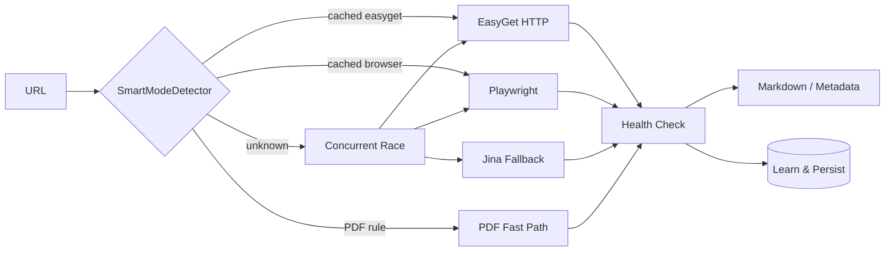

<div align="center">


# OmniFetcher

### AI Agent Network Base

**Adaptive URL fetch engine for agents & RAG — learns the best route per domain (HTTP · Browser · PDF).**

<br />

[](https://www.python.org/)
[](LICENSE)
[](https://fastapi.tiangolo.com/)
[](https://playwright.dev/)
[](https://github.com/lijiandao/omnifetcher/pulls)

[English](README.md) · [中文](README.zh-CN.md)

<br />

[Quick Start](#-quick-start) · [Benchmarks](#-benchmarks) · [Architecture](#-architecture) · [Configuration](#-configuration)

</div>

---

## ✨ Highlights

<table>
<tr>
<td width="50%">

**🧠 Self-learning router**

`SmartModeDetector` caches per-domain decisions, discovers PDF patterns, and improves after every successful fetch — not a static rules file.

</td>
<td width="50%">

**⚡ Multi-lane race**

EasyGet (HTTP) · Playwright (JS) · PDF fast path · optional Jina fallback — concurrent with graceful cancellation.

</td>
</tr>
<tr>
<td>

**🛡️ Content quality guards**

Encoding detection, mojibake checks (`ftfy`), binary guards, Cloudflare / captcha heuristics.

</td>
<td>

**🌐 Agent-ready network layer**

Proxy rotation (Clash), optional double-hop relay, huge-HTML readability map-reduce → clean Markdown.

</td>
</tr>
</table>

---

## 📊 Benchmarks

> Measured in maintainer test environment (2025–2026). Full screenshot gallery: **[📷 Benchmark Gallery (EN)](docs/BENCHMARKS.md)** · **[📷 性能对比图集 (中文)](docs/BENCHMARKS.zh-CN.md)**


| Scenario | URL type | **OmniFetcher** | Tavily | Exa | Metaso / Reader API |
|:--|:--|--:|--:|--:|--:|
| arXiv 9-page PDF | Direct PDF | **791 ms** ✅ | ~3 s (cached est.) | ~1.8 s | 2.8 s |
| arXiv ~300-page PDF | Large PDF | **3.24 s** ✅ | partial | 4 s timeout ❌ | 25.5 s fail ❌ |
| Zhihu Q&A | Anti-bot SPA | **1.61 s** ✅ | access denied ❌ | 4 s timeout ❌ | 5.5 s empty ❌ |
| Juejin article | HTML + MD cleanup | **435 ms** ✅ | — | 4 s timeout ❌ | 0.7 s gate page ❌ |

<details open>
<summary><b>📸 arXiv 9-page PDF — side-by-side screenshots</b></summary>
<br />
<table>
<tr>
<td width="33%" align="center"><b>OmniFetcher · 791 ms</b><br/></td>
<td width="33%" align="center"><b>Metaso · 2.8 s</b><br/></td>
<td width="33%" align="center"><b>Exa · ~1.8 s</b><br/></td>
</tr>
</table>
</details>

<details>
<summary><b>📸 arXiv 300-page PDF — OmniFetcher vs competitors</b></summary>
<br />
<table>
<tr>
<td width="25%" align="center"><b>OmniFetcher · 3.24 s</b><br/></td>
<td width="25%" align="center"><b>Metaso · fail</b><br/></td>
<td width="25%" align="center"><b>Exa · timeout</b><br/></td>
<td width="25%" align="center"><b>Tavily · partial</b><br/></td>
</tr>
</table>
</details>

<details>
<summary><b>📸 Zhihu anti-bot page</b></summary>
<br />
<table>
<tr>
<td width="25%" align="center"><b>OmniFetcher · 1.61 s</b><br/></td>
<td width="25%" align="center"><b>Metaso · 5.5 s</b><br/></td>
<td width="25%" align="center"><b>Tavily · denied</b><br/></td>
<td width="25%" align="center"><b>Exa · timeout</b><br/></td>
</tr>
</table>
</details>

<details>
<summary><b>📸 Juejin article (includes Markdown cleanup)</b></summary>
<br />
<table>
<tr>
<td width="33%" align="center"><b>OmniFetcher · 435 ms</b><br/></td>
<td width="33%" align="center"><b>Metaso · gate page</b><br/></td>
<td width="33%" align="center"><b>Exa · timeout</b><br/></td>
</tr>
</table>
</details>

**Cold → warm learning** (same domain, repeated fetches):

| Visit | Avg decision time | Notes |
|--:|--:|:--|
| 1st | ~10 s | Probe + concurrent race |
| 3rd | ~3 s | Domain score accumulating |
| 5th+ | **~1 s** | Cache hit on optimal lane |

```bash
python benchmarks/run_benchmark.py
python benchmarks/run_benchmark.py --url "https://arxiv.org/pdf/2503.21088"
```

---

## 🚀 Quick start

```bash
git clone https://github.com/lijiandao/omnifetcher.git
cd omnifetcher

python -m venv .venv && source .venv/bin/activate
pip install -r requirements.txt
playwright install chromium   # Linux; Windows can use Edge profile

python -m omnifetcher.start
# → http://127.0.0.1:8900
```

**Fetch a URL**

```bash
curl -s -X POST http://127.0.0.1:8900/crawl \
  -H 'Content-Type: application/json' \
  -d '{
    "urls": ["https://arxiv.org/abs/2503.21088"],
    "mode": "concurrent",
    "use_intellicache": true,
    "htmlclean_enabled": true,
    "extract_title": true
  }'
```

Or:

```bash
python examples/fetch_one.py "https://arxiv.org/abs/2503.21088"
```

---

## 🏗 Architecture




| Module | Role |
|:--|:--|
| `SmartModeDetector` | SPA/PDF rules, domain score cache, auto-learning |
| `EasyGetCrawler` | Fast HTTP, encoding & garbled-text detection |
| `PlaywrightCrawler` | JS rendering, anti-bot, Edge persistent context |
| `EasyPDFCrawler` | Direct PDF download & text extraction |
| `concurrent_strategies` | EasyGet ∥ Playwright ∥ Jina race + cancel |
| `proxy/` | Clash rotation, weighted node selection, double-hop relay |
| `tackle_huge_html` | Readability + map-reduce for large pages |

---

## ⚙️ Configuration

| Path | Purpose |
|:--|:--|
| `config/smart_detector_config.json` | SPA/PDF rules + learned domain decisions |
| `config/proxy_config.yaml` | Clash / proxy pool settings |
| `config/proxy_state/` | Runtime proxy usage history *(gitignored)* |

| Variable | Default | Description |
|:--|:--|:--|
| `OMNIFETCHER_HOST` | `0.0.0.0` | HTTP bind host |
| `OMNIFETCHER_PORT` | `8900` | HTTP bind port |
| `OMNIFETCHER_BASE` | `http://127.0.0.1:8900` | Client base URL for examples |
| `APP_LOG_LEVEL` | `INFO` | Log level |
| `DOUBLE_HOP_USER_HK` | — | Upstream proxy user (HK pool) |
| `DOUBLE_HOP_USER_GLOBAL` | — | Upstream proxy user (global pool) |
| `DOUBLE_HOP_PASS` | — | Upstream proxy password |

<details>
<summary><b>Optional: double-hop proxy</b></summary>

<br />

For geo-sensitive fetches, run the local relay with your own upstream credentials:

```bash
export DOUBLE_HOP_USER_HK=your-user
export DOUBLE_HOP_PASS=your-pass
python -m omnifetcher.proxy.double_hop_proxy
```

</details>

---

## 📦 Install as CLI

```bash
pip install -e .
omnifetcher   # same as python -m omnifetcher.start
```

---

## 🤝 Contributing

Issues and PRs welcome. Please include repro URLs when reporting fetch failures.

---

## 📄 License

[Apache License 2.0](LICENSE)

---

## ⚠️ Compliance

You are responsible for complying with target sites' terms of service and robots policies. Use reasonable rate limits and respect copyright.

<div align="center">
<sub>Built for agents that need the web — fast, clean, and smarter every run.</sub>
</div>
