<div align="center">


# OmniFetcher

### AI Agent Network Base

**面向 Agent 与 RAG 的自适应 URL 抓取引擎 —— 自动学习每个域名该走 HTTP、浏览器还是 PDF 专线。**

<br />

[](https://www.python.org/)
[](LICENSE)
[](https://fastapi.tiangolo.com/)
[](https://playwright.dev/)
[](https://github.com/lijiandao/omnifetcher/pulls)

[English](README.md) · [中文](README.zh-CN.md)

<br />

[快速开始](#-快速开始) · [性能对比](#-性能对比) · [架构](#-架构) · [配置](#-配置)

</div>

---

## ✨ 核心亮点

<table>
<tr>
<td width="50%">

**🧠 自学习路由**

`SmartModeDetector` 按域名缓存决策、发现 PDF 路径模式，每次成功抓取后持续进化 —— 不是写死的规则表。

</td>
<td width="50%">

**⚡ 多通路竞速**

EasyGet（HTTP）· Playwright（JS）· PDF 专线 · 可选 Jina 兜底 —— 并发竞速 + 优雅取消。

</td>
</tr>
<tr>
<td>

**🛡️ 内容质量守卫**

编码检测、乱码识别（`ftfy`）、二进制误判拦截、Cloudflare / 验证码启发式检测。

</td>
<td>

**🌐 Agent 网络底座**

Clash 代理轮换、可选双跳中继、超大 HTML Readability 分片 → 干净 Markdown。

</td>
</tr>
</table>

---

## 📊 性能对比

> 维护者测试环境实测（2025–2026）。完整截图图集：**[📷 Benchmark Gallery (EN)](docs/BENCHMARKS.md)** · **[📷 性能对比图集 (中文)](docs/BENCHMARKS.zh-CN.md)**

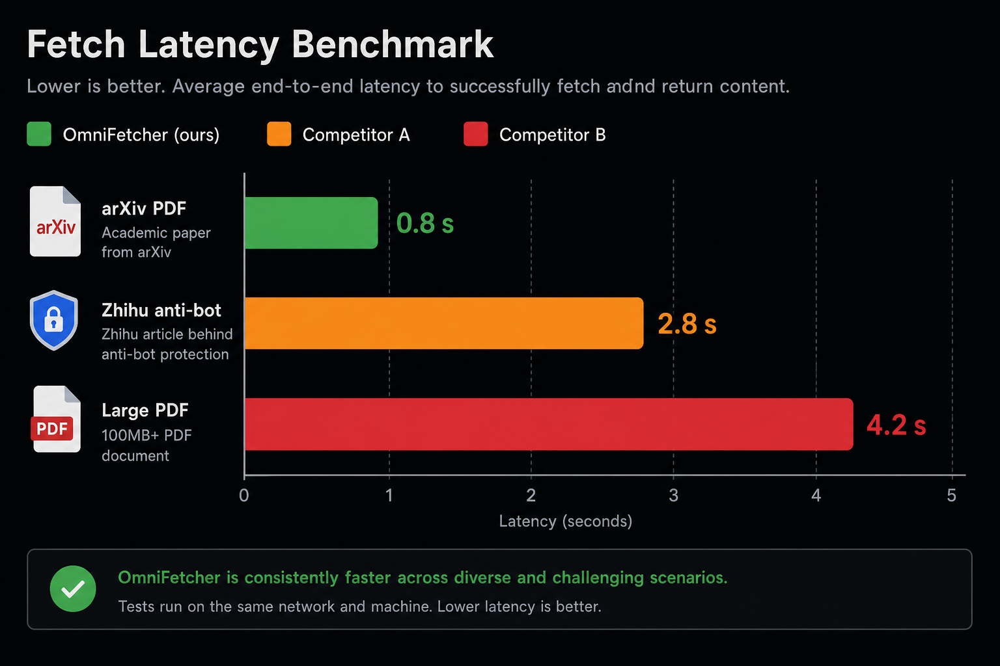

| 场景 | 链接类型 | **OmniFetcher** | Tavily | Exa | Metaso / Reader API |
|:--|:--|--:|--:|--:|--:|
| arXiv 9 页 PDF | 直连 PDF | **791 ms** ✅ | ~3 s（缓存估计） | ~1.8 s | 2.8 s |
| arXiv ~300 页 PDF | 超大 PDF | **3.24 s** ✅ | 片段 | 4 s 超时 ❌ | 25.5 s 失败 ❌ |
| 知乎问答 | 反爬 SPA | **1.61 s** ✅ | 拒绝访问 ❌ | 4 s 超时 ❌ | 5.5 s 空内容 ❌ |
| 掘金文章 | HTML + MD 清洗 | **435 ms** ✅ | — | 4 s 超时 ❌ | 0.7 s 拦截页 ❌ |

<details open>
<summary><b>📸 arXiv 9 页 PDF — 并排截图</b></summary>
<br />
<table>
<tr>
<td width="33%" align="center"><b>OmniFetcher · 791 ms</b><br/>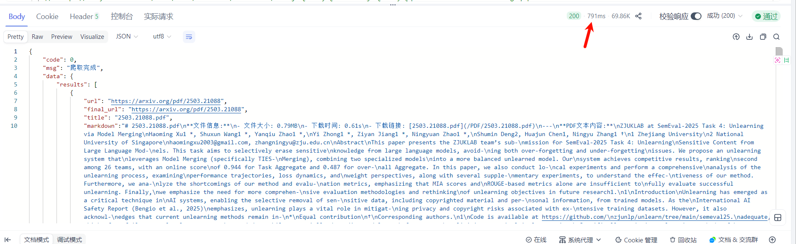</td>
<td width="33%" align="center"><b>Metaso · 2.8 s</b><br/>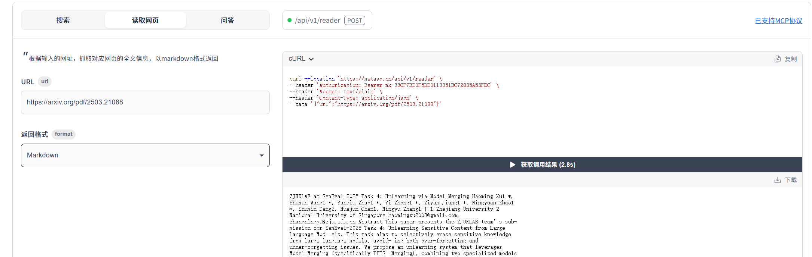</td>
<td width="33%" align="center"><b>Exa · ~1.8 s</b><br/>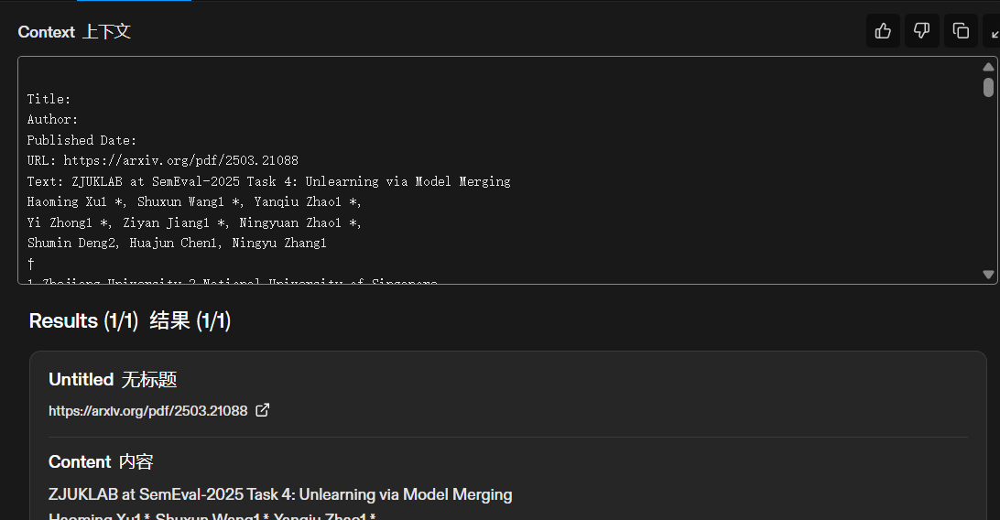</td>
</tr>
</table>
</details>

<details>
<summary><b>📸 arXiv 300 页 PDF — 与竞品对比</b></summary>
<br />
<table>
<tr>
<td width="25%" align="center"><b>OmniFetcher · 3.24 s</b><br/>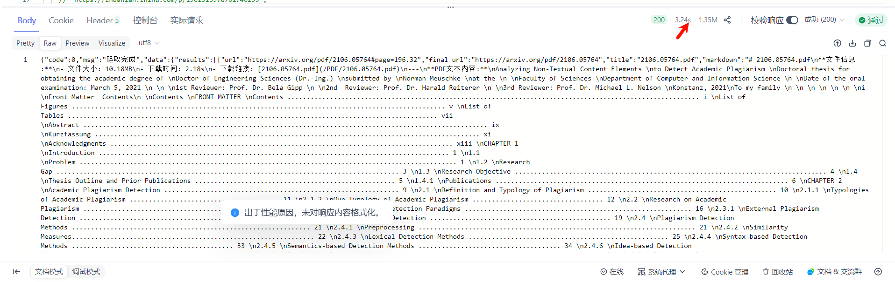</td>
<td width="25%" align="center"><b>Metaso · 失败</b><br/>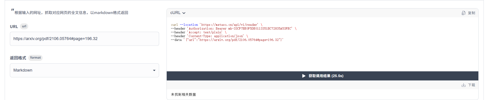</td>
<td width="25%" align="center"><b>Exa · 超时</b><br/>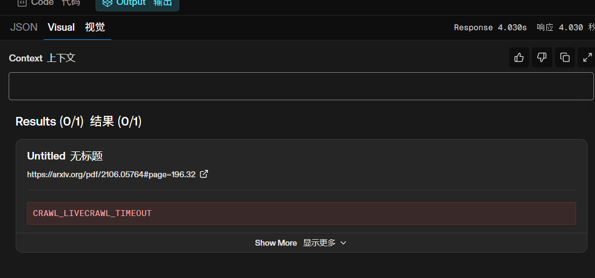</td>
<td width="25%" align="center"><b>Tavily · 片段</b><br/>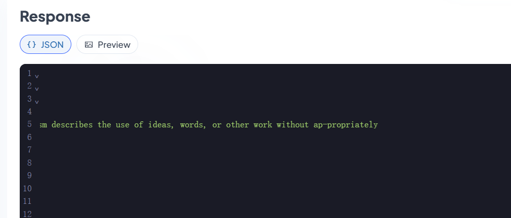</td>
</tr>
</table>
</details>

<details>
<summary><b>📸 知乎反爬页面</b></summary>
<br />
<table>
<tr>
<td width="25%" align="center"><b>OmniFetcher · 1.61 s</b><br/>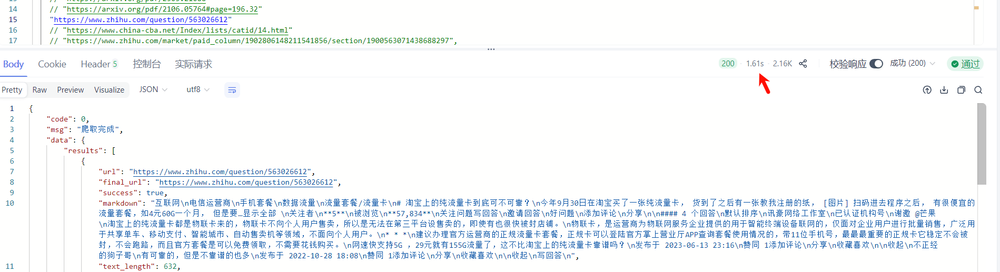</td>
<td width="25%" align="center"><b>Metaso · 5.5 s</b><br/>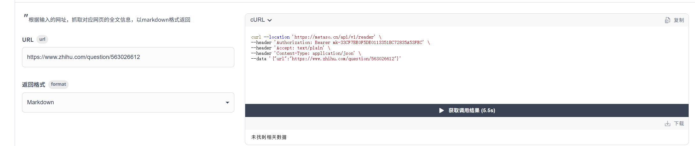</td>
<td width="25%" align="center"><b>Tavily · 拒绝</b><br/>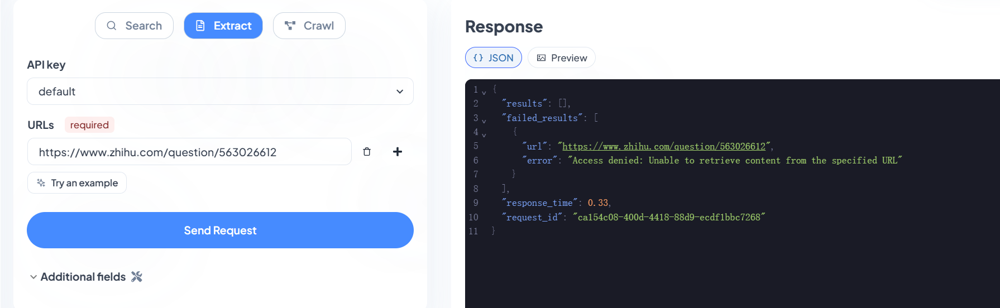</td>
<td width="25%" align="center"><b>Exa · 超时</b><br/>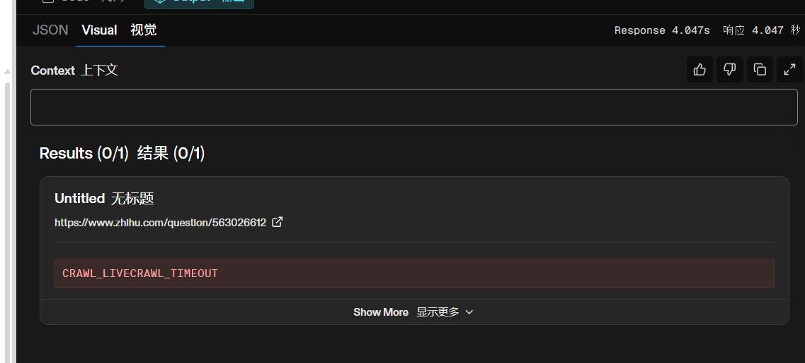</td>
</tr>
</table>
</details>

<details>
<summary><b>📸 掘金文章（含 Markdown 清洗）</b></summary>
<br />
<table>
<tr>
<td width="33%" align="center"><b>OmniFetcher · 435 ms</b><br/>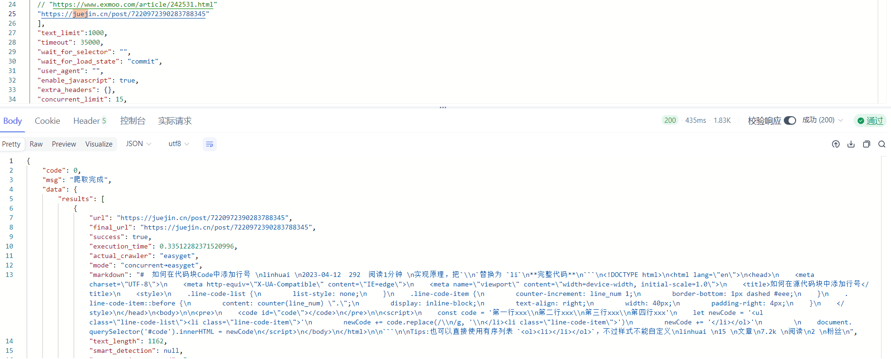</td>
<td width="33%" align="center"><b>Metaso · 拦截页</b><br/>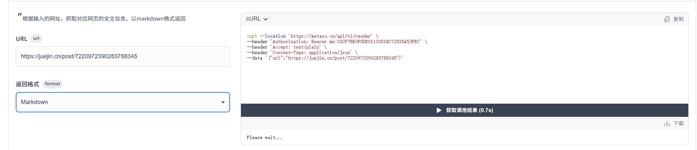</td>
<td width="33%" align="center"><b>Exa · 超时</b><br/>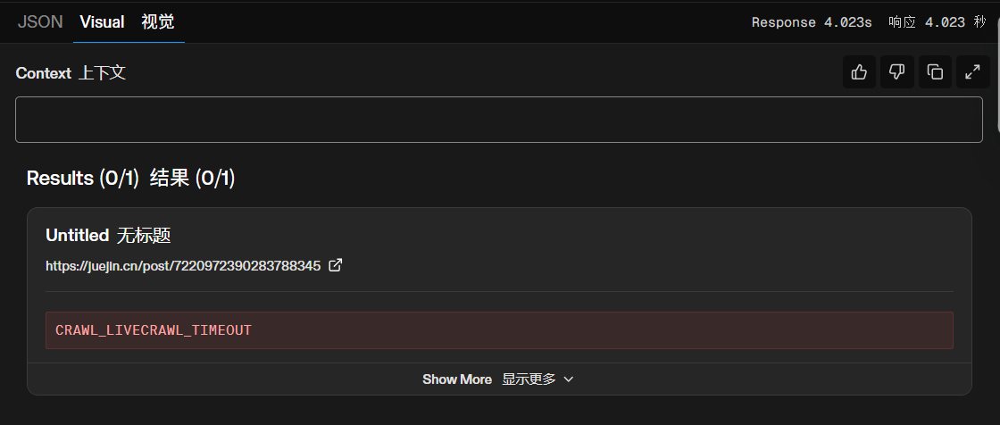</td>
</tr>
</table>
</details>

**冷启动 → 越用越快**（同域名重复访问）：

| 第几次 | 平均决策耗时 | 说明 |
|--:|--:|:--|
| 第 1 次 | ~10 s | 探测 + 并发竞速 |
| 第 3 次 | ~3 s | 域名分数累积 |
| 第 5 次+ | **~1 s** | 命中最优通路缓存 |

```bash
python benchmarks/run_benchmark.py
python benchmarks/run_benchmark.py --url "https://arxiv.org/pdf/2503.21088"
```

---

## 🚀 快速开始

```bash
git clone https://github.com/lijiandao/omnifetcher.git
cd omnifetcher

python -m venv .venv && source .venv/bin/activate
pip install -r requirements.txt
playwright install chromium   # Linux；Windows 可用 Edge 配置

python -m omnifetcher.start
# → http://127.0.0.1:8900
```

**抓取示例**

```bash
curl -s -X POST http://127.0.0.1:8900/crawl \
  -H 'Content-Type: application/json' \
  -d '{
    "urls": ["https://arxiv.org/abs/2503.21088"],
    "mode": "concurrent",
    "use_intellicache": true,
    "htmlclean_enabled": true,
    "extract_title": true
  }'
```

或：

```bash
python examples/fetch_one.py "https://arxiv.org/abs/2503.21088"
```

---

## 🏗 架构

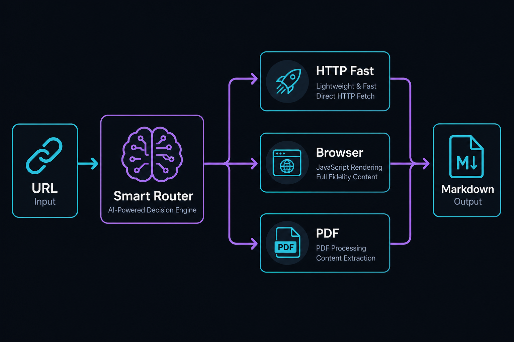

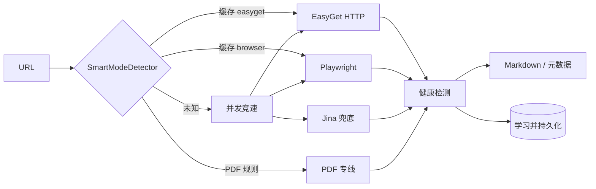

| 模块 | 职责 |
|:--|:--|
| `SmartModeDetector` | SPA/PDF 规则、域名分数缓存、自动学习 |
| `EasyGetCrawler` | 高速 HTTP、编码与乱码检测 |
| `PlaywrightCrawler` | JS 渲染、反爬、Edge 持久化上下文 |
| `EasyPDFCrawler` | PDF 直连下载与文本提取 |
| `concurrent_strategies` | EasyGet ∥ Playwright ∥ Jina 竞速 |
| `proxy/` | Clash 轮换、加权选节点、双跳中继 |
| `tackle_huge_html` | 超大页面 Readability 分片 |

---

## ⚙️ 配置

| 路径 | 用途 |
|:--|:--|
| `config/smart_detector_config.json` | SPA/PDF 规则 + 已学习域名决策 |
| `config/proxy_config.yaml` | Clash / 代理池配置 |
| `config/proxy_state/` | 运行时代理使用记录 *(不入库)* |

| 环境变量 | 默认值 | 说明 |
|:--|:--|:--|
| `OMNIFETCHER_HOST` | `0.0.0.0` | HTTP 监听地址 |
| `OMNIFETCHER_PORT` | `8900` | HTTP 端口 |
| `OMNIFETCHER_BASE` | `http://127.0.0.1:8900` | 示例脚本使用的服务地址 |
| `APP_LOG_LEVEL` | `INFO` | 日志级别 |
| `DOUBLE_HOP_USER_HK` | — | 上游代理账号（HK 池） |
| `DOUBLE_HOP_USER_GLOBAL` | — | 上游代理账号（全球池） |
| `DOUBLE_HOP_PASS` | — | 上游代理密码 |

<details>
<summary><b>可选：双跳代理</b></summary>

<br />

对地域敏感的上游请求，可启动本地中继（需自备上游凭证）：

```bash
export DOUBLE_HOP_USER_HK=your-user
export DOUBLE_HOP_PASS=your-pass
python -m omnifetcher.proxy.double_hop_proxy
```

</details>

---

## 📦 CLI 安装

```bash
pip install -e .
omnifetcher   # 等价于 python -m omnifetcher.start
```

---

## 🤝 参与贡献

欢迎 Issue 与 PR。报告抓取失败时请附上可复现 URL。

---

## 📄 许可证

[Apache License 2.0](LICENSE)

---

## ⚠️ 合规说明

请自行遵守目标网站的 ToS 与 robots 策略，合理控制频率，尊重版权。

<div align="center">
<sub>为需要「读网页」的 Agent 而生 —— 更快、更干净、越用越聪明。</sub>
</div>
