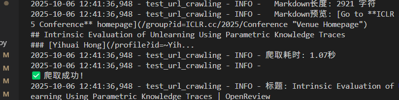
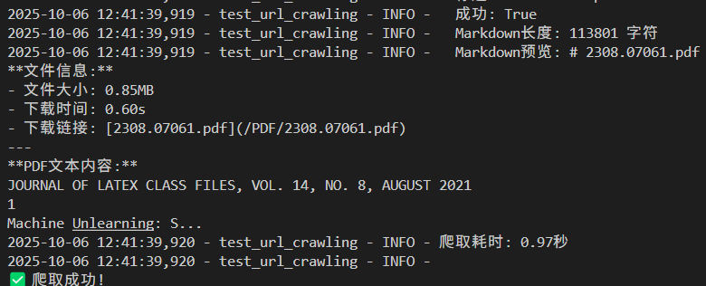
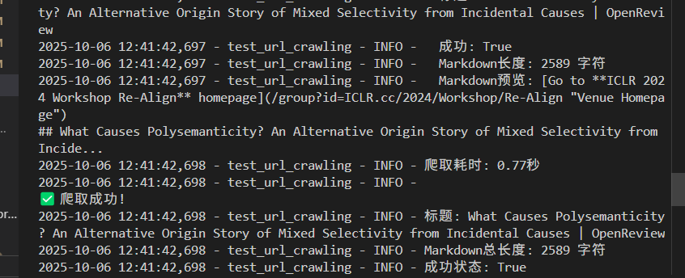

# 性能对比图集

> 受控环境实测截图（2025–2026）。  
> [English](BENCHMARKS.md)

每个场景在 **相同 URL** 下对比 OmniFetcher 与第三方 Reader / Crawl API。

---

## 1 · arXiv 9 页 PDF

**链接：** `https://arxiv.org/pdf/2503.21088`

| 引擎 | 结果 | 耗时 |
|:--|:--|--:|
| **OmniFetcher** | PDF 全文 → Markdown | **791 ms** |
| Metaso Reader API | 成功 | 2.8 s |
| Exa Extract | 成功 | ~1.8 s |

<table>
<tr>
<td width="33%" align="center"><b>OmniFetcher</b><br/></td>
<td width="33%" align="center"><b>Metaso Reader</b><br/></td>
<td width="33%" align="center"><b>Exa Extract</b><br/></td>
</tr>
</table>

---

## 2 · arXiv ~300 页 PDF（10 MB+）

**链接：** `https://arxiv.org/pdf/2106.05764`

| 引擎 | 结果 | 耗时 |
|:--|:--|--:|
| **OmniFetcher** | 目录 + 正文 Markdown | **3.24 s** |
| Metaso Reader API | 未找到相关数据 | 25.5 s |
| Exa Extract | `CRAWL_LIVECRAWL_TIMEOUT` | 4.03 s |
| Tavily Extract | 仅返回片段 | ~3 s |

<table>
<tr>
<td width="25%" align="center"><b>OmniFetcher</b><br/></td>
<td width="25%" align="center"><b>Metaso</b><br/></td>
<td width="25%" align="center"><b>Exa</b><br/></td>
<td width="25%" align="center"><b>Tavily</b><br/></td>
</tr>
</table>

---

## 3 · 知乎（反爬 SPA）

**链接：** `https://www.zhihu.com/question/563026612`

| 引擎 | 结果 | 耗时 |
|:--|:--|--:|
| **OmniFetcher** | 干净 Markdown（632 字） | **1.61 s** |
| Metaso Reader API | 未找到相关数据 | 5.5 s |
| Tavily Extract | Access denied | 0.33 s |
| Exa Extract | `CRAWL_LIVECRAWL_TIMEOUT` | 4.05 s |

<table>
<tr>
<td width="25%" align="center"><b>OmniFetcher</b><br/></td>
<td width="25%" align="center"><b>Metaso</b><br/></td>
<td width="25%" align="center"><b>Tavily</b><br/></td>
<td width="25%" align="center"><b>Exa</b><br/></td>
</tr>
</table>

---

## 4 · 掘金文章（静态 HTML + Markdown 清洗）

**链接：** `https://juejin.cn/post/7220972390283788345`

| 引擎 | 结果 | 耗时 |
|:--|:--|--:|
| **OmniFetcher** | 抓取 + Readability → Markdown | **435 ms** |
| Metaso Reader API | “Please wait…” 拦截页 | 0.7 s |
| Exa Extract | `CRAWL_LIVECRAWL_TIMEOUT` | 4.02 s |

<table>
<tr>
<td width="33%" align="center"><b>OmniFetcher</b><br/></td>
<td width="33%" align="center"><b>Metaso</b><br/></td>
<td width="33%" align="center"><b>Exa</b><br/></td>
</tr>
</table>

> OmniFetcher 的耗时会计入 **网络请求 + HTML 清洗 + Markdown 提取**，不是裸 HTTP。

---

## 5 · PDF 与学术页面（终端日志）

同批次测试中的 PDF / OpenReview 样例：

<table>
<tr>
<td width="33%" align="center"><b>OpenReview（1.07 s）</b><br/></td>
<td width="33%" align="center"><b>arXiv PDF 0.85 MB（0.97 s）</b><br/></td>
<td width="33%" align="center"><b>OpenReview（0.77 s）</b><br/></td>
</tr>
</table>

---

## 本地复现

```bash
python -m omnifetcher.start
python benchmarks/run_benchmark.py
python benchmarks/run_benchmark.py --url "https://arxiv.org/pdf/2503.21088"
```

---

## 说明

- 竞品为公开可用的 Reader / Crawl 服务，在相同 URL 下对比。
- 截图为内部 QA 留存；竞品界面可能随版本变化。
- 复测时请遵守目标站点 ToS 与频率限制。
